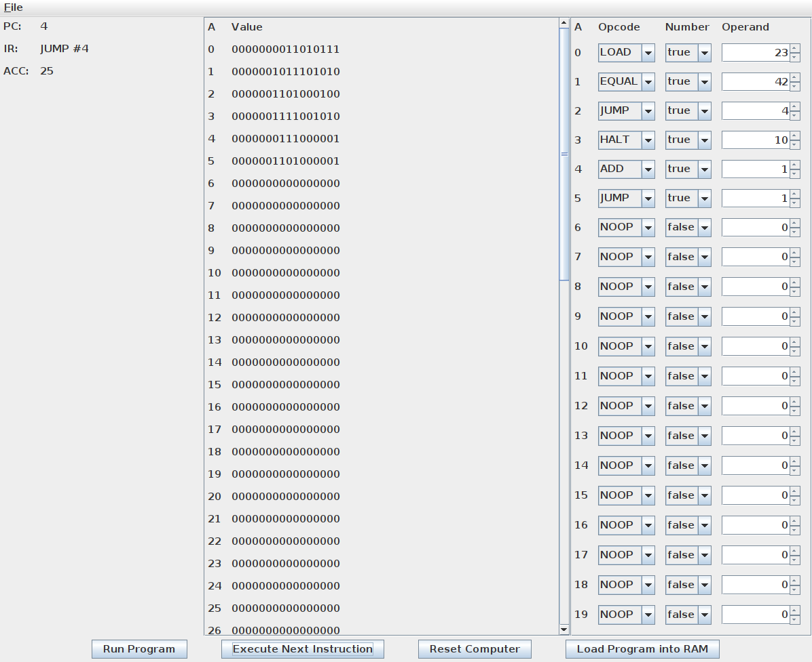

# SimpleComputerEmulator
   

       
## German
Bei diesem Programm handelt es sich um einen sehr einfachen Computer
Emulator mit einem sehr einschränkten Befehlssatz, welcher in dem
Module Computerarchitektur und Betriebssysteme (CAB) -- angeboten von
der Virtuelle Fachhochschule (VFH) -- vorgestellt wird.

Der SimpleComputerEmulator verfolgt zwei Ziele.

 1. Den Kursteilnehmern die Funktionsweise eines Computers näher zu bringen.
 2. Den Kursteilnehmern die Möglichkeit zu geben erste Schritte in der Assembler Programmierung zu tätigen.

## English
This program is a very simple computer emulator that
understands only a very limited set of commands, i.e, eight
opcodes. The instruction set is defined in the course
Computerarchitektur und Betriebssysteme (CAB) offered by the
Virtuelle Fachhochschule (VFH)

The SimpleComputerEmulator aims for two goals.

 1. to teach students how a computer works.
 2. give students the opportunity to take their first steps in assembler programming.
    
